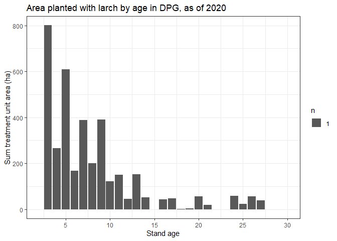
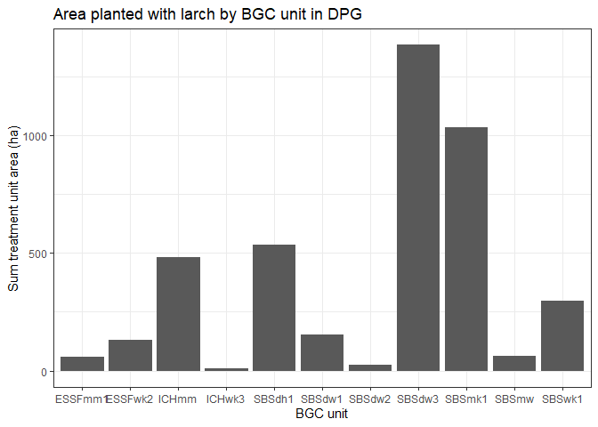

Querying RESULTS silviculture data using the bcdata package
================
Hardy Griesbauer
06/04/2020

<!--

  Copyright 2019 Province of British Columbia

  Licensed under the Apache License, Version 2.0 (the "License");
  you may not use this file except in compliance with the License.
  You may obtain a copy of the License at

  http://www.apache.org/licenses/LICENSE-2.0

  Unless required by applicable law or agreed to in writing, software distributed under the License is distributed on an "AS IS" BASIS,
  WITHOUT WARRANTIES OR CONDITIONS OF ANY KIND, either express or implied.
  See the License for the specific language governing permissions and limitations under the License.

-->

## The bcdata package

The `bcdata` package provides an easy way to query, download and
visualize datasets in the [B.C. Data
Catalogue](https://catalogue.data.gov.bc.ca) through the R interface.
This short vignette will demonstrate a few ways that we can do this
using RESULTS and other datasets.

More information on the `bcdata` package can be found
[here](https://bcgov.github.io/bcdata/)

## Getting started

First thing we need to do is make sure we have some packages installed.
If you don’t have the package already installed on your machine, run the
following code to install from CRAN:

``` r
# Install bcdata from CRAN
install.packages("bcdata")
```

To start the demo, let’s load some libraries:

``` r
library(tidyverse)
library(bcdata)
library(tmap)
library(tmaptools)
library(sf)
```

### Different ways to use the bcdata package

The main functions in `bcdata` are:

1.  bcdc\_browse() - Open the catalogue in your default browser
2.  bcdc\_search() - Search records in the catalogue
3.  bcdc\_search\_facets() - List catalogue facet search options
4.  bcdc\_get\_record() - Print a catalogue record
5.  bcdc\_get\_data() - Get catalogue data
6.  bcdc\_query\_geodata() - Get & query catalogue geospatial data
    available through a Web Service

In general, I use an iterative workflow with these packages:

1.  Search for datasets in the catalogue;
2.  Query the dataset to understand the data structure;
3.  Filter for records of interest; and
4.  Download the data into R

<!-- end list -->

``` r
bcdc_search("silviculture")
```

    ## List of B.C. Data Catalogue Records
    ## 
    ## Number of records: 22 (Showing the top 10)
    ## Titles:
    ## 1: Indicator Summary Data: Trends in Silviculture in B.C. (csv)
    ##  ID: b3369823-d130-4e8d-bcca-55c8749fab40
    ##  Name: indicator-summary-data-trends-in-silviculture-in-b-c-
    ## 2: RESULTS - Activity Treatment Units (other, wms, kml)
    ##  ID: 07cabbdf-d7bf-4c50-919d-5b7d80086ef5
    ##  Name: results-activity-treatment-units
    ## 3: RESULTS - Forest Cover Silviculture (other, wms, kml)
    ##  ID: 258bb088-4113-47b1-b568-ce20bd64e3e3
    ##  Name: results-forest-cover-silviculture
    ## 4: RESULTS - Forest Cover Species (Attribute Only) (other)
    ##  ID: 2db77f8b-765b-488f-9752-f1349cf6ebfc
    ##  Name: results-forest-cover-species-attribute-only
    ## 5: RESULTS - Planting (other, wms)
    ##  ID: 3666c26a-32d8-43e4-b8ad-59a315c7d3ce
    ##  Name: results-planting
    ## 6: RESULTS - Forest Cover Reserve (other, wms, kml)
    ##  ID: 7028ac47-45dd-41d7-a371-be5a04177afe
    ##  Name: results-forest-cover-reserve
    ## 7: RESULTS - Openings (Attribute Only) (other)
    ##  ID: f6d17c00-d4b9-401b-a20e-ef7e37b6d5e3
    ##  Name: results-openings-attribute-only
    ## 8: RESULTS - Openings svw (other, wms, kml)
    ##  ID: 53a17fec-e9ad-4ac0-95e6-f5106a97e677
    ##  Name: results-openings-svw
    ## 9: RESULTS - Forest Cover Inventory (other, wms)
    ##  ID: 56ac43a7-724a-4f01-b193-d5f9a16ef0a8
    ##  Name: results-forest-cover-inventory
    ## 10: Employment by industry sector and place of work, aggregated to census division (other)
    ##  ID: f5c79d19-5d2a-489d-818c-57701b62cddf
    ##  Name: employment-by-industry-sector-and-place-of-work-aggregated-to-census-division 
    ## 
    ## Access a single record by calling bcdc_get_record(ID)
    ##       with the ID from the desired record.

Records with *wms* are spatial files that can be queried and downloaded
using `bcdc_query_geodata`.

### Silviculture data in BC

Silviculture information in BC is largely collected and tracked through
the RESULTS database (Reporting Silviculture Updates and Land Status
Tracking System). The database stores silviculture-related information
on the management of openings, disturbances, silviculture activities and
obligation declarations as required by the Forest and Range Practices
Act. Data in RESULTS are publically available through
catalogue.data.gov.bc.ca. More information on RESULTS can be found
[here](https://www2.gov.bc.ca/gov/content/industry/forestry/managing-our-forest-resources/silviculture/silviculture-reporting-results).

### Reforestation with climate considerations in the Prince George District

Western larch has been identified as a tree species that will be
well-adapted to projected future climates in northern BC. Forest policy has been developed to allow foresters to plant larch
outside its natural range as a climate change adaptation silviculture
measure.

#### Question: how much western larch is being planted in the Prince George District?

We can gather information to answer this question using RESULTS -
silviculture forest cover dataset. First, let’s take a look at the
dataset contents using
    `bcdc_query_geodata`:

``` r
bcdc_query_geodata("results-forest-cover-silviculture") 
```

    ## Warning: It is advised to use the permanent id ('258bb088-4113-47b1-b568-ce20bd64e3e3') rather than the name of the record ('results-forest-cover-silviculture') to guard against future name changes.

    ## Querying 'results-forest-cover-silviculture' record
    ## * Using collect() on this object will return 869725 features and 159 fields
    ## * At most six rows of the record are printed here
    ## ------------------------------------------------------------------------------------------------------------
    ## Simple feature collection with 6 features and 159 fields
    ## geometry type:  MULTIPOLYGON
    ## dimension:      XY
    ## bbox:           xmin: 1147890 ymin: 676633.7 xmax: 1411085 ymax: 1083545
    ## epsg (SRID):    3005
    ## proj4string:    +proj=aea +lat_1=50 +lat_2=58.5 +lat_0=45 +lon_0=-126 +x_0=1000000 +y_0=0 +ellps=GRS80 +towgs84=0,0,0,0,0,0,0 +units=m +no_defs
    ## # A tibble: 6 x 160
    ##   id    FOREST_COVER_ID STOCKING_STANDA~ OPENING_ID STANDARDS_UNIT_~
    ##   <chr>           <int>            <int>      <int> <chr>           
    ## 1 WHSE~         3994018          1805957    1486231 2               
    ## 2 WHSE~         3994007               NA    1248495 <NA>            
    ## 3 WHSE~         3993995          2263260    1728926 1               
    ## 4 WHSE~         3994067               NA    1120935 <NA>            
    ## 5 WHSE~         3994009          1404558    1248495 A               
    ## 6 WHSE~         3994057          1211894    1120935 B               
    ## # ... with 155 more variables: SILV_POLYGON_NUMBER <chr>,
    ## #   SILV_POLYGON_AREA <dbl>, SILV_POLYGON_NET_AREA <dbl>,
    ## #   SILV_NON_MAPPED_AREA <int>, STOCKING_STATUS_CODE <chr>,
    ## #   STOCKING_TYPE_CODE <chr>, STOCKING_CLASS_CODE <chr>,
    ## #   SILV_RESERVE_CODE <chr>, SILV_RESERVE_OBJECTIVE_CODE <chr>,
    ## #   TREE_COVER_PATTERN_CODE <chr>, REENTRY_YEAR <chr>,
    ## #   REFERENCE_YEAR <int>, SITE_INDEX <int>, SITE_INDEX_SOURCE_CODE <chr>,
    ## #   BGC_ZONE_CODE <chr>, BGC_SUBZONE_CODE <chr>, BGC_VARIANT <chr>,
    ## #   BGC_PHASE <chr>, BEC_SITE_SERIES <chr>, BEC_SITE_TYPE <chr>,
    ## #   BEC_SERAL <chr>, IS_SILV_IMPLIED_IND <chr>,
    ## #   FOREST_COVER_SILV_TYPE <chr>, S_FOREST_COVER_LAYER_ID <int>,
    ## #   S_TOTAL_STEMS_PER_HA <chr>, S_TOTAL_WELL_SPACED_STEMS_HA <int>,
    ## #   S_WELL_SPACED_STEMS_PER_HA <int>, S_FREE_GROWING_STEMS_PER_HA <int>,
    ## #   S_CROWN_CLOSURE_PERCENT <chr>, S_BASAL_AREA <chr>,
    ## #   S_SPECIES_CODE_1 <chr>, S_SPECIES_PERCENT_1 <int>,
    ## #   S_SPECIES_AGE_1 <int>, S_SPECIES_HEIGHT_1 <dbl>,
    ## #   S_SPECIES_CODE_2 <chr>, S_SPECIES_PERCENT_2 <int>,
    ## #   S_SPECIES_AGE_2 <chr>, S_SPECIES_HEIGHT_2 <chr>,
    ## #   S_SPECIES_CODE_3 <chr>, S_SPECIES_PERCENT_3 <int>,
    ## #   S_SPECIES_CODE_4 <chr>, S_SPECIES_PERCENT_4 <chr>,
    ## #   S_SPECIES_CODE_5 <chr>, S_SPECIES_PERCENT_5 <chr>,
    ## #   S_MORE_SPECIES_EXIST_IND <chr>, S_SILV_LABEL <chr>,
    ## #   S1_FOREST_COVER_LAYER_ID <int>, S1_TOTAL_STEMS_PER_HA <int>,
    ## #   S1_TOTAL_WELL_SPACED_STEMS_HA <int>,
    ## #   S1_WELL_SPACED_STEMS_PER_HA <int>, S1_FREE_GROWING_STEMS_PER_HA <int>,
    ## #   S1_CROWN_CLOSURE_PERCENT <int>, S1_BASAL_AREA <chr>,
    ## #   S1_SPECIES_CODE_1 <chr>, S1_SPECIES_PERCENT_1 <int>,
    ## #   S1_SPECIES_AGE_1 <int>, S1_SPECIES_HEIGHT_1 <int>,
    ## #   S1_SPECIES_CODE_2 <chr>, S1_SPECIES_PERCENT_2 <chr>,
    ## #   S1_SPECIES_AGE_2 <chr>, S1_SPECIES_HEIGHT_2 <chr>,
    ## #   S1_SPECIES_CODE_3 <chr>, S1_SPECIES_PERCENT_3 <chr>,
    ## #   S1_SPECIES_CODE_4 <chr>, S1_SPECIES_PERCENT_4 <chr>,
    ## #   S1_SPECIES_CODE_5 <chr>, S1_SPECIES_PERCENT_5 <chr>,
    ## #   S1_MORE_SPECIES_EXIST_IND <chr>, S1_SILV_LABEL <chr>,
    ## #   S2_FOREST_COVER_LAYER_ID <int>, S2_TOTAL_STEMS_PER_HA <int>,
    ## #   S2_TOTAL_WELL_SPACED_STEMS_HA <int>,
    ## #   S2_WELL_SPACED_STEMS_PER_HA <int>, S2_FREE_GROWING_STEMS_PER_HA <int>,
    ## #   S2_CROWN_CLOSURE_PERCENT <int>, S2_BASAL_AREA <chr>,
    ## #   S2_SPECIES_CODE_1 <chr>, S2_SPECIES_PERCENT_1 <int>,
    ## #   S2_SPECIES_AGE_1 <int>, S2_SPECIES_HEIGHT_1 <int>,
    ## #   S2_SPECIES_CODE_2 <chr>, S2_SPECIES_PERCENT_2 <chr>,
    ## #   S2_SPECIES_AGE_2 <chr>, S2_SPECIES_HEIGHT_2 <chr>,
    ## #   S2_SPECIES_CODE_3 <chr>, S2_SPECIES_PERCENT_3 <chr>,
    ## #   S2_SPECIES_CODE_4 <chr>, S2_SPECIES_PERCENT_4 <chr>,
    ## #   S2_SPECIES_CODE_5 <chr>, S2_SPECIES_PERCENT_5 <chr>,
    ## #   S2_MORE_SPECIES_EXIST_IND <chr>, S2_SILV_LABEL <chr>,
    ## #   S3_FOREST_COVER_LAYER_ID <int>, S3_TOTAL_STEMS_PER_HA <int>,
    ## #   S3_TOTAL_WELL_SPACED_STEMS_HA <int>,
    ## #   S3_WELL_SPACED_STEMS_PER_HA <int>, S3_FREE_GROWING_STEMS_PER_HA <int>,
    ## #   S3_CROWN_CLOSURE_PERCENT <int>, S3_BASAL_AREA <chr>,
    ## #   S3_SPECIES_CODE_1 <chr>, ...

The output from this query shows that this dataset has over 850,000
features and 159 fields. Each feature is a treatment unit within a
harvested opening, and contains information on the leading five tree
species that are present in each treatment unit, including stems per
hectare, age, and height.

*Note this could be better accomplished using the RESULTS-planting
layer, however, the dataset appears incomplete at this point*

This dataset would be too large (\~1GB) to download efficiently. So,
let’s use `filter` to refine our query:

1.  Filter openings that are in Prince George District; and
2.  Filter treatment units that have western larch present.

First, let’s filter for openings in the PG Natural Resource District.
We’ll use `bcdata` package to do this by downloading the spatial
boundary for the PG Natural Resource District and use that as a filter:

``` r
# First, let's take a look at the natural resource district dataset
bcdc_query_geodata("natural-resource-nr-district")
```

    ## Querying 'natural-resource-nr-district' record
    ## * Using collect() on this object will return 23 features and 12 fields
    ## * At most six rows of the record are printed here
    ## ------------------------------------------------------------------------------------------------------------
    ## Simple feature collection with 6 features and 12 fields
    ## geometry type:  POLYGON
    ## dimension:      XY
    ## bbox:           xmin: 831051 ymin: 455592.3 xmax: 1749980 ymax: 1368536
    ## epsg (SRID):    3005
    ## proj4string:    +proj=aea +lat_1=50 +lat_2=58.5 +lat_0=45 +lon_0=-126 +x_0=1000000 +y_0=0 +ellps=GRS80 +towgs84=0,0,0,0,0,0,0 +units=m +no_defs
    ## # A tibble: 6 x 13
    ##   id    DISTRICT_NAME ORG_UNIT ORG_UNIT_NAME REGION_ORG_UNIT
    ##   <chr> <chr>         <chr>    <chr>         <chr>          
    ## 1 WHSE~ Cariboo-Chil~ DCC      Cariboo-Chil~ RCB            
    ## 2 WHSE~ Cascades Nat~ DCS      Cascades Nat~ RTO            
    ## 3 WHSE~ Sea to Sky N~ DSQ      Sea to Sky N~ RSC            
    ## 4 WHSE~ Stuart Necha~ DVA      Stuart Necha~ ROM            
    ## 5 WHSE~ Okanagan Shu~ DOS      Okanagan Shu~ RTO            
    ## 6 WHSE~ Selkirk Natu~ DSE      Selkirk Natu~ RKB            
    ## # ... with 8 more variables: REGION_ORG_UNIT_NAME <chr>,
    ## #   FEATURE_CODE <chr>, FEATURE_NAME <chr>, OBJECTID <int>,
    ## #   SE_ANNO_CAD_DATA <chr>, FEATURE_AREA_SQM <dbl>,
    ## #   FEATURE_LENGTH_M <dbl>, geometry <POLYGON [m]>

We can see that there are 23 Natural Resource districts in the province.
District codes are stored in the ‘ORG\_UNIT’ column Let’s filter
districts for DPG (Prince George) and download it as a `simple feature`.

``` r
dpg<-  # Create new spatial feature called dpg
  bcdc_query_geodata("natural-resource-nr-district") %>%  # query the nr district dataset 
  filter(ORG_UNIT=="DPG") %>% # filter for Prince George District
  collect() # and download it 
```

This is a small file, and shouldn’t take long to download. We can plot
it to double check:

``` r
dpg %>% 
  ggplot()+
  geom_sf()
```

<!-- -->

Now we have a spatial object that we can use as a bounding box to filter
and download records in the RESULTS - silviculture layer. We’ll just
download openings that have larch planted, to make for a smaller file
size.

*Note the chunk below can take a few minutes to run, depending on your
network connection\!*

``` r
# First, let's list what tree species we are interested in
 sppList=c("LW") # LW is the code for western larch
 
# Now let's filter the records and download the data

  treesDPG<- # create new spatial feature by
    
    bcdc_query_geodata("results-forest-cover-silviculture") %>% # querying the results silviculture layer and
   
    filter(INTERSECTS(dpg)) %>% # filter for records that are within the DPG and
    
   # filter for our species within any of the five species per TU
            filter(S_SPECIES_CODE_1 %in% sppList|
            S_SPECIES_CODE_2 %in% sppList|
            S_SPECIES_CODE_3 %in% sppList|
            S_SPECIES_CODE_4 %in% sppList|
            S_SPECIES_CODE_5 %in% sppList) %>% 
    
    collect() # and download the file
```

Let’s look at the dimensions of this object:

``` r
dim(treesDPG)
```

    ## [1] 160 160

We can see here are 160 treatment units planted with larch in DPG.

Now we can plot the openings and see how things look:

``` r
tmap_mode("view")

# Create a bounding box   
pgBox<-st_bbox(c(xmin = 1160004, xmax = 1190000, ymax = 990000, ymin = 970000), crs = st_crs(3005))

# Plot with basemap
tm_basemap("Esri.WorldStreetMap") +
tm_shape(treesDPG,bbox=pgBox)+
tm_polygons(col="red")
```

<!-- -->

*Note:* This map is just as an example. I’ve zoomed in to show larch
plantations (in red) west of Prince George.

### Summaries

We can also create some quick summaries of the data, treating the
attribute table as a data frame in R:

#### Question: what is the age distribution of larch plantations in DPG?

``` r
treesDPG %>% 
  st_drop_geometry() %>% # drop geometry, likely not necessary
  mutate(age=2020-REFERENCE_YEAR+S_SPECIES_AGE_1) %>% # create an age column

  # plotting
  ggplot()+
  aes(x=age,y=FEATURE_AREA_SQM/10000)+ # convert area to hectares
  geom_bar(stat="sum")+
  ylab("Sum treatment unit area (ha)")+
  theme(legend.position="none")+
  scale_x_continuous(name="Stand age", limits=c(2,30),
                     breaks=seq(from=5,to=30,by=5))+
  ggtitle("Area planted with larch by age in DPG, as of 2020")+
  theme(legend.position = "none")+
  theme_bw()
```

<!-- -->

#### Question: what is the BEC distribution of larch plantations in DPG?

We can download biogeoclimatic data using `bcdata` and join to an
existing dataset using the `st_join` function.

``` r
# First, load BEC data into your workspace 
# by querying BGC data and filtering for DPG
bgcPG <- bcdc_query_geodata("WHSE_FOREST_VEGETATION.BEC_BIOGEOCLIMATIC_POLY") %>% 
  filter(BBOX(st_bbox(dpg),crs=`ESP:3005`)) %>% # Note the different way to filter
  collect()


# Now join with dataset
treesDPG<-  # update spatial feature 
    st_join(treesDPG,bgcPG[,"MAP_LABEL"]) # join BEC data for each polygon
```

Now, we can summarize area planted with larch by BGC unit.

``` r
treesDPG %>% 
  st_drop_geometry() %>% # drop geometry
  group_by(MAP_LABEL) %>% # group polygons by BGC unit
  summarise(Area=sum(FEATURE_AREA_SQM)/10000) %>% 
 
   # plotting
  ggplot()+
  aes(x=MAP_LABEL,y=Area)+
  geom_bar(stat="Identity")+
  ylab("Sum treatment unit area (ha)")+
  theme(legend.position="none")+
  ggtitle("Area planted with larch by BGC unit in DPG")+
  xlab("BGC unit")+
  theme_bw()
```

<!-- -->

-----
